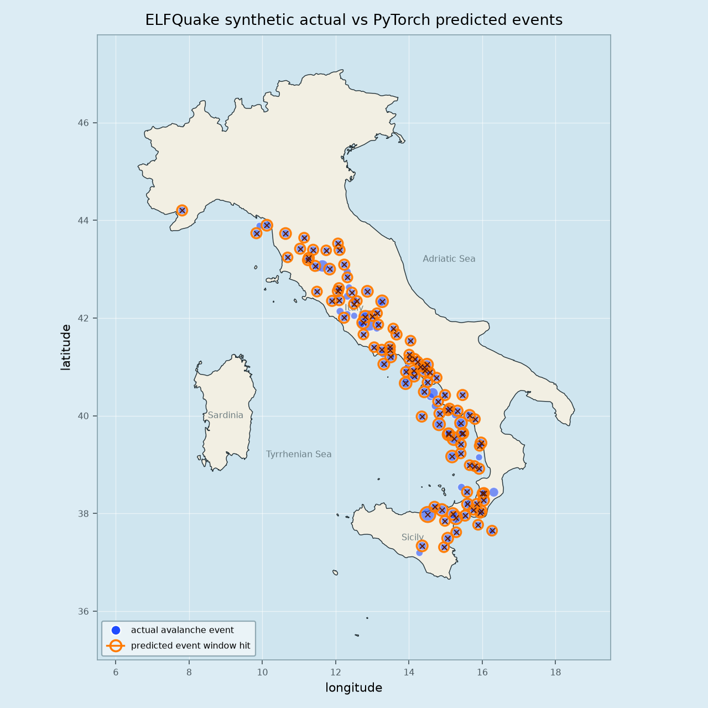
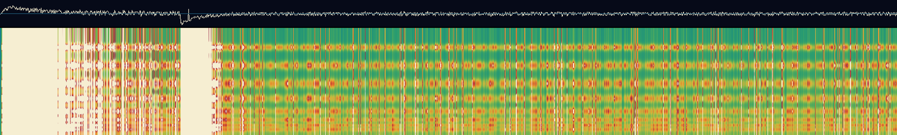

# ELFQuake

ELFQuake is a research project examining whether [Extremely](https://en.wikipedia.org/wiki/Extremely_low_frequency)/[Very Low Frequency](https://en.wikipedia.org/wiki/Very_low_frequency) radio observations can augment seismic and astronomical data enough to support useful predictive modeling of earthquakes.

The core hypothesis is that natural ELF/VLF radio anomalies may contain signal that is not present in seismic event history alone. At least [one study](https://pubs.geoscienceworld.org/ssa/bssa/article-abstract/113/6/2461/627949/Earthquake-Forecasting-Using-Big-Data-and)
 suggests this may be a viable approach.

We wish to exploit more modern machine learning/AI techniques to create a predictive model based on the transformer architecture. A key consideration is the availability of real-world data for training. The plan is to build a system (based around an avalanche model) with similar chacteristics to the geological system and use this to generate synthetic data for baseline training. After validation of this stage, real-world data will be used for fine-tuning.

*To be useful any claims must be demonstrated against reproducible seismic-only baselines, held-out time periods, and multimodal ablations.*

## Status

Data acquisition, feature extraction, prospective rows, smoke models, CPU PyTorch tabular and sequence baselines, CPU-only sandpile simulation, and first synthetic VLF comparison tooling are implemented; **no earthquake prediction capability is claimed**.

Right now, while awaiting further data, the focus is on the simulation and scaffolding for a machine learning system. Evaluation of the current model can be found in [report.md](docs/report.md).

### Simulated Earthquakes



### Simulated VLF Signal




## Background

This work was initially prompted by the tragedy of the [2009 L'Aquila earthquake](https://en.wikipedia.org/wiki/2009_L'Aquila_earthquake). Around the same period I was aware of developments in Deep Learning and coincidentally had stumbled on material related to natural radio signals occurring as precursors to seismic events (see [vlf.it](http://www.vlf.it/)). I made a start on research and began a blog about it : [ELFQuake](https://elfquake.wordpress.com/) (which I wound up using for general blogging). At the time it seemed possible but *very difficult*. But since then predictive models have improved in leaps and bounds, meaning that prediction has a much better chance of working. Not only that, but the ability to delegate much of the coding work to an intelligent assistant means that the difficulty in building the system has been drastically reduced. 

## Current Work

* INGV seismic event acquisition, normalization, and Italy/Central Italy training windows.
* Cumiana VLF live spectrogram capture through systemd, with pixel-derived image features.
* Astronomical and space-weather archive connectors and normalization.
* Prospective VLF-anchored feature rows with pending target labels.
* Dependency-light logistic checks and a CPU PyTorch tabular MLP for synthetic aligned rows.
* A first CPU PyTorch GRU sequence model over synthetic avalanche and piezo/VLF sensor tensors.
* Summary comparison, sequence sweep, and missing-modality scripts for model diagnostics.
* Real Cumiana VLF image features materialized into the same sequence shape as synthetic piezo/VLF inputs.
* Real prospective aligned model inputs scaffolded for all-Italy and central-Italy rows; real training remains blocked by insufficient class variation.
* VLF model feature roles that allow synthetic piezo/VLF analogue data to exercise the same PyTorch VLF path before real labels mature.
* Sandpile simulation with separate seismic-like avalanche outputs and piezo/VLF analogue outputs.

## Simulation

The simulation is an artificial mountain-like grid where broad background loading is combined with repeated localized stress at fixed point sources. As slopes become unstable, small avalanches redistribute height to neighbouring cells. The aim is to generate synthetic sequences that are close enough in shape to real-world seismic data to be useful as training data for a deep learning system, especially before enough matched seismic, VLF, and astronomical data is available.

It also includes piezo-like sensors that watch quartz-like susceptible regions near failure and produce the VLF/WAV analogue channel. Direct seismic-like event data is kept separate and is derived from avalanche/toppling behavior.

Run the local simulation demo pipeline with:

```sh
./run-all.sh
```

Default outputs use `data/derived/sim/mountain_256x256_seed42_10000` as the prefix. The normal piezo image is `*.piezo_vlf_summary.png` from `*.piezo.csv`; the direct seismic event analogue is `*.avalanche_events.csv`. The older FFT diagnostic is opt-in with `RUN_FFT=1`.

The event-map demo projects avalanche-derived locations over an Apennine-style Italy belt and uses point size for synthetic magnitude.

Render a demo overlay of actual synthetic avalanche events and PyTorch predicted-positive target-window hits with:

```sh
./prediction-event-map.sh
```

Compare the simulated VLF analogue image against captured Cumiana VLF spectrograms with:

```sh
./compare-piezo-vlf.sh
```

This is a simplified stress-and-release analogy, not a geological model. Its value depends on whether the generated data has useful structural similarity to real observations. Good performance on simulated avalanches would only show that the tooling can learn synthetic patterns; real claims still require held-out seismic, VLF, and astronomical data.

## Key Docs

* [Overview](docs/overview.md)
* [Next Actions](docs/next-actions.md)
* [Development Environment](docs/development-environment.md)
* [Source Inventory](docs/source-inventory.md)
* [Multimodal Feasibility](docs/multimodal-feasibility.md)
* [Systemd Service](docs/systemd-service.md)
* [Initial Model Trials](docs/initial-model-trials.md)
* [Sandpile Simulation](docs/sandpile-simulation.md)
