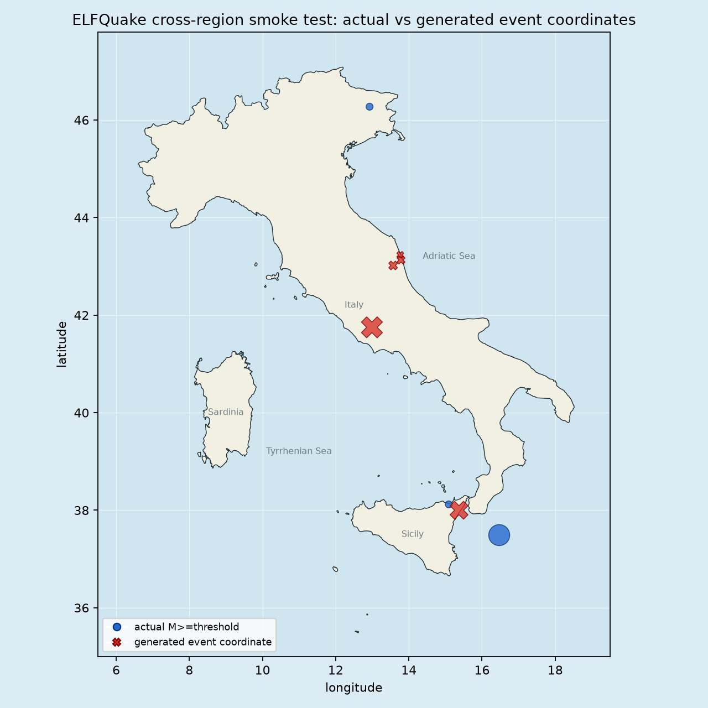

---
hide:
  - navigation
  - toc
---

# ELFQuake

ELFQuake is a research project testing whether seismic, natural VLF radio, and astronomical data can be aligned into useful multimodal earthquake-modeling experiments.

## Current status

The project has a reproducible CPU-only pipeline covering acquisition, normalization, synthetic avalanche simulation, multimodal windows, self-supervised representation learning, and chronological held-out evaluation. **No earthquake prediction capability is currently demonstrated.**

The central research question is whether VLF observations add information beyond seismic history. That question remains open because the real VLF record is still short and sparsely aligned with both positive and negative seismic outcomes.

[Read the current status](status.md){ .md-button .md-button--primary }
[Read the journal](blog/index.md){ .md-button }

## Explore

- [Research overview](overview.md)
- [Latest report](report.md)
- [Data sources](source-inventory.md)
- [Model candidates](model-candidates.md)
- [Simulation](sandpile-simulation.md)
- [Reproducible steps](steps.md)
- [How you can help](help.md)

This map is an engineering visualization of a held-out experiment, not a forecast.
